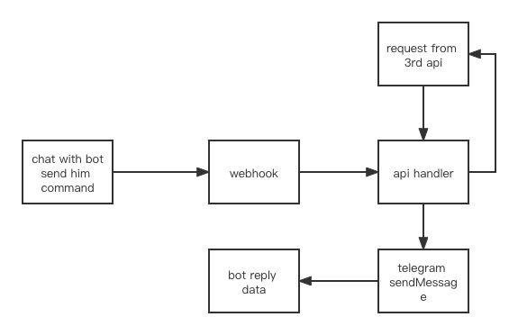

最近因为改换乘地铁上班，一直记不住园区的班车时刻表，并且班车可能过一段时间就会调整，园区提供的公众号也是体验很差，展示了太多冗余信息，于是搞了一个telegram_bot来查询实时的发车时间。

### 准备工作

1. 申请bot
2. 抓包班车api
3. node项目
4. 域名解析

### 整理下思路



### 一些笔记

#### fastify

> Fastify is a web framework highly focused on providing the best developer experience with the least overhead and a powerful plugin architecture. It is inspired by Hapi and Express and as far as we know, it is one of the fastest web frameworks in town.

使用[Fastify](https://github.com/fastify/fastify) 搭建web server，目前只了解了下Server，Routes，Logging，后面有空再看下Erros，Plugins，Testing等。

#### module alias

安装 `module-alias` 依赖然后在package.json中增加如下配置：

```json
"_moduleAliases": {
  "@root": ".",
  "@lib": "./src/lib",
  "@service": "./src/service"
},
```

就可以在代码中通过这样的方式引入模块：

```js
const api = require('@lib/api');
```

#### telegram

1. 申请机器人

只需要在telegram中搜索到一个BotFather的账号，然后在聊天窗口中通过对话的方式，获取到机器人的token。This is really cool!

2. telegram webhook
   - 通过调用[接口](https://core.telegram.org/bots/api#setwebhook)的方式来设置webhook，
   - 与BotFather聊天来配置bot_command
   - 收到推送后在调用[发送消息](https://core.telegram.org/bots/api#sendmessage)接口来回复

#### github actions

通过github自带的actions来实现持续集成和部署，部署通过ssh连接到服务器。以下是配置的脚本，目前只加了部署相关的：

```yaml
name: Node.js CI

on:
  push:
    branches: [master]

jobs:
  build-and-deploy:
    runs-on: ubuntu-latest
    environment: prod
    steps:
      - name: Deploy
        env:
          PROJECT_NAME: ${{ github.event.repository.name }}
        uses: fifsky/ssh-action@master
        with:
          command: |
            cd /var/www/
            if cd ${{ env.PROJECT_NAME }}; then git pull; else git clone git@github.com:${{ github.repository }}.git ${{ env.PROJECT_NAME }}; fi
            cd ${{ env.PROJECT_NAME }};
            export NVM_DIR="$HOME/.nvm"
            [ -s "$NVM_DIR/nvm.sh" ] && \. "$NVM_DIR/nvm.sh";
            git pull origin master && npm i --production && npm run stop && npm start
          host: ${{ secrets.HOST }}
          user: ${{ secrets.USER }}
          key: ${{ secrets.KEY }}
```

1. 可以在本地创建好密钥，将私钥配置在github repo中，将公钥添加到服务器的~/.ssh/authorized_keys中（推荐使用`ssh-copy-id`添加）
2. 在github repo详情中配置上面对应的secrets

项目已上线～[项目地址](https://github.com/RainKolwa/bus-sanlin-node)
