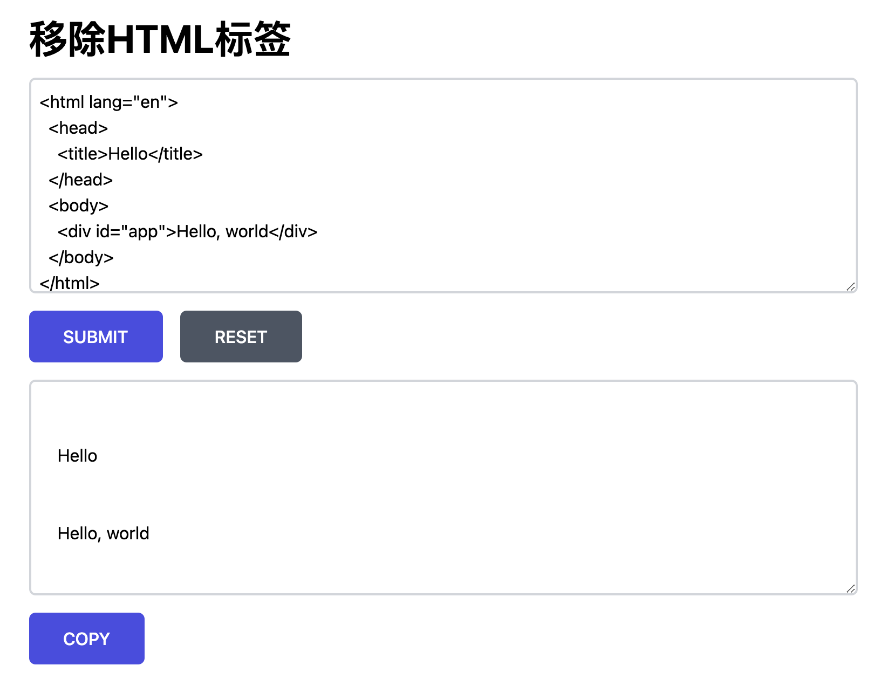

最近打算重复造轮子。准备增加一个域名：[名字还没想好](https://tools.rainlee.fun)，里面专门放一些自己写的小工具。第一个已经想好了，用于移除HTML标签。

### html-tag-thanos

项目名称：html-tag-thanos，不过不打算独立一个项目，小工具都统一放在 [Toolkit](https://github.com/RainKolwa/toolkit) 中。这个项目使用到的技术：

1. build tool: [vite](https://vitejs.dev/)
2. framework: vue3
3. style: [tailwindcss](https://tailwindcss.com/)
4. code style: prettier + eslint
5. ci/cd: github actions

简单地梳理下需求及方案：

1. 通过正则（尖括号且以英文字母或/开头，以尖括号结尾，非贪婪匹配）匹配

```js
content.replace(/<\/?[a-zA-Z].*?>+/gm, "")
```

2. 如果输入中含有style标签，同时移除style标签以内的内容

```js
content.replace(/<style.*?>.*?<\/style>/gm, "")
```

3. 提供输入框，支持reset
4. 提供输出框，支持copy

功能展示如下：



### 一些笔记

关于自动部署

通过github actions实现自动打包，我用的是一个[rsync](https://github.com/Burnett01/rsync-deployments)的action来将打包产物同步到服务器。每次我提交代码，push到master，部署的脚本就会自动执行。添加了注释说明的workflow配置如下：

```yaml
name: Node.js CI
# 只在push到master或者合并到master分支触发
on:
  push:
    branches: [ master ]
  pull_request:
    branches: [ master ]

jobs:
  
  build: # 打包

    runs-on: ubuntu-latest

    strategy:
      matrix:
        node-version: [14.x]

    steps:
    - uses: actions/checkout@v2
    - name: Use Node.js ${{ matrix.node-version }}
      uses: actions/setup-node@v2
      with:
        node-version: ${{ matrix.node-version }}
        cache: 'npm'
    - run: npm ci
    - run: npm run build --if-present # 执行打包命令

    - name: Archive production artifacts # 上传产物
      uses: actions/upload-artifact@v2
      with:
        name: dist
        path: dist
  
  publish:
    runs-on: ubuntu-latest
    needs: build
    steps:
    - uses: actions/checkout@v2
    - name: Download artifacts # 下载产物到当前目录
      uses: actions/download-artifact@v2
      with:
        name: dist
        path: dist
    - name: Display structure of downloaded files
      run: ls -R
    - name: Rsync deployments # 将当前目录，即当前repo及打包后的产物同步到服务器
      uses: burnett01/rsync-deployments@5.1
      with:
        switches: -av --delete
        remote_path: ${{ secrets.DEPLOY_PATH }}
        remote_host: ${{ secrets.DEPLOY_HOST }}
        remote_user: ${{ secrets.DEPLOY_USER }}
        remote_key: ${{ secrets.DEPLOY_KEY }}
```
